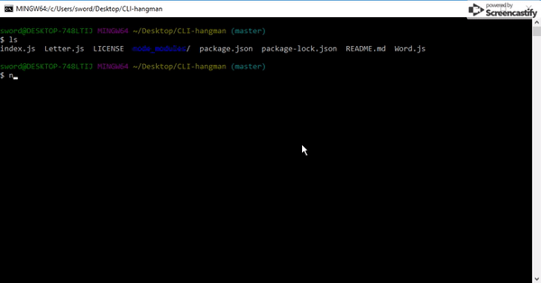

# CLI-hangman
This is a hangman game built with node and is played exclusively through your terminal/git bash.
## Getting Started
You have to install the inquirer node package to play this game.
All you have to do after cloning this repository is run
```
npm install
```
in the directory where you cloned this repository. The package.json contains all the dependencies.
## Playing the Game


You have to guess the word before you run out of guesses. You lose a guess if you enter a letter that does not exist in the word and if you have not already guessed that letter.
Once the word is guessed, or you run out of guesses, the old word is shown as well as a new word.

This is periodic table of elements themed, so I hope you are good at Chemistry.

## Creating the Game
This game was created with the purpose of learning how to use constructors.
There are 2 constructors, a Letter constructor, and a Word constructor. The Word constructor consists of many Letter constructors. We use constructors by exporting and requiring from separate js files.
``` js
module.exports = Word;
var Word = require('./Word.js');
module.exports = Letter;
var Letter = require('./Letter.js');
```
This is the Letter constructor. It contains the letter itself, and two methods that display the letter, and checks the user's guess against the letter.

``` js 
var Letter = function(letter) {
    this.letter = letter;
    this.guessed = false;
    this.display = function() {
        if (this.guessed) {
            return this.letter;
        }
        else {
            return '_';
        }
    };
    this.guess = function(guess) {
        if (guess === this.letter) {
            this.guessed = true;
        }
    }
}
```
If the user guesses correctly, the underscore is changed into the actual letter.

The Word constructor takes a string and converts it into Letter obects. 

The game logic is in index.js and it is what you see in the gif above. 

## Author

[Bryan Liang](https://github.com/liangbryan2)